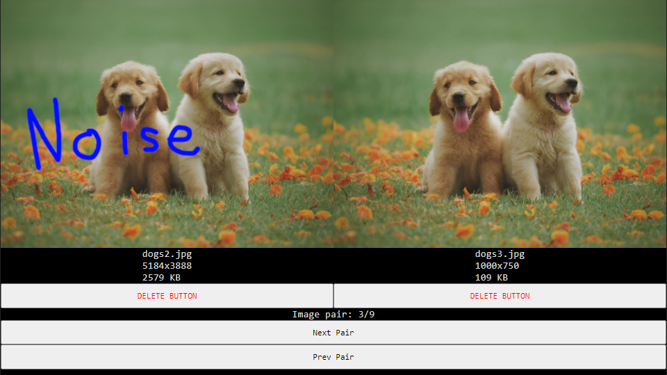
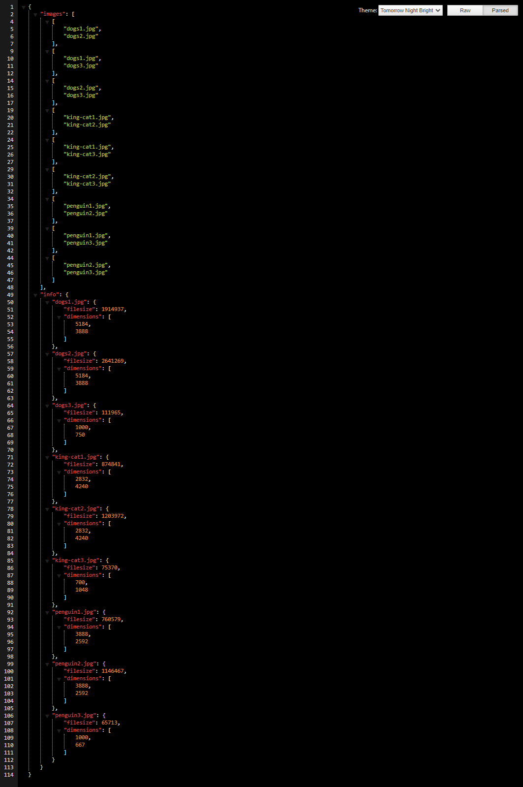

# Image Similarity Searcher (Backend)




## Background

---

### **What is this?**

This project aims to make organizing images much easier when cleaning out hard drives by providing a simple GUI to manage deletions of similar images on the machine running the backend.

### **Why would I use this?**

If you're like me and you constantly backup images on all of your devices over the span of years, you may have some image redundancy. These similar images may have differing resolutions, quality, file format, or file size, and it would be nearly impossible to manually find and remember all similar images across multiple directories. 

This project aims to offload that hard work from the user.

### **How does it work?**

1. When the backend starts, it creates a 50x50 pixel greyscale version of every image (with [Jimp](https://github.com/oliver-moran/jimp)) in the user-specified image folder and grabs the image dimensions, file name, and file size. 

1. It then acts as a REST API which will perform both a hamming distance and pixel diffing on each possible pair of minified greyscale images to calculate image similarity. The image pairs and image data are then sent to the frontend. 

1. The frontend will then fetch the original images which are served statically from the backend.

1. On deletion request, the backend will **MOVE** the image to a folder marked for manual deletion by the user (This is done to prevent accidental image deletions!).

## Usage (Frontend)

---

Follow the instructions on the [Backend Repository](https://github.com/SkyAceMike/Image-Similarity-Searcher-Backend) first!

1. Open the frontend directory
```
cd Path\To\Frontend\Directory
```
2. Install npm packages
```
npm install
```
3. Run development server
```
npm start
```
When React is finished loading, it should automatically open a new tab in your browser.
Now, you can navigate through detected similar images and mark images for deletion!

To actually delete the marked images, head back into the backend directory and delete the `!tmp` and `!delete_batch` folders. Only the images you wish to keep should remain within the `!put_images_here` folder!

>**Tip: I designed this webapp to work on half of a monitor so you can multitask while cleaning out your hard drive!**

